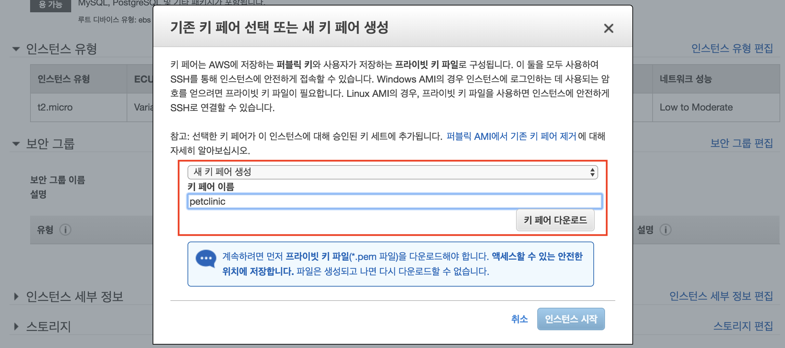

# EC2 + S3로 서비스 배포하기

## EC2 배포하기

### 인스턴스 실행
 
Amazon Linux AMI 2018.03.0 (HVM), SSD Volume Type - t2.micro 인스턴스를 하나 실행

인스턴스 이름 : `petclinic ec2`

***보안 그룹***

***키페어 이름 - petclinic***


### ssh 접속 및 배포환경 구축
1. `petclinc ec2` 인스턴스의 java 버전을 8로 업그레이드 한다. (관련 링크 : http://jojoldu.tistory.com/261)
    ```bash
    sudo yum install -y java-1.8.0-openjdk-devel.x86_64
    sudo /usr/sbin/alternatives --config java
    sudo yum remove java-1.7.0-openjdk
    javac -version
    ```
1. `petclinic ec2` 인스턴스에 git을 설치한다.
    ```bash
    sudo yum install git
    ```

### 배포 

```bash 
git clone https://github.com/{your-github-name}/petclinic-rest
cd petclinic-rest
# 백그라운드 실행
nohup ./mvnw spring-boot:run &
```

### 배포 확인

- 브라우저에서 `http://your-public-ip:9460/actuator/health` 접속하여 확인
- 브라우저에서 `http://your-public-ip:9460/vets`(수의사 리스트 API) 접속하여 확인


    
    

## 프론트앤드 S3에 배포하기

### 버켓 만들기 
    
이름은 중복되지 않도록 `${자신의 아이디}-petclinc-www` 로 짓는다. 

정적 웹사이트 호스팅 설정     

버켓 퍼블릭으로 설정


### vs code로 개발환경 접속


### 코드 수정
1. 배포스크립트 수정

    package.json에 deploy:s3 스크립트에서 bucket 명을 prerequisites에서 만든 자신의 버켓명으로 수정한다.
    ```json
    ...
    "deploy:s3": "npm run build && aws s3 cp dist/ s3://{your-bucket-name} --recursive"
    ...
    ```
1. api host 수정

    src/services/restService.js 에서 서비스 호스트를 배포된 호스트로 변경한다.
    ```js
    const serviceHost = 'http://your-public-ip:9460'
    ```
### 배포
1. ssh로 개발환경 접속
1. 배포 스크립트 실행
```bash
cd /home/ec2-user/workspace/petclinic-front/
npm install
npm run deploy:s3
```
### 배포 확인
1. http://{your-bucket-name}.s3-website.ap-northeast-2.amazonaws.com 에 접속하여 확인한다.
1. http://{your-bucket-name}.s3-website.ap-northeast-2.amazonaws.com/#/staff 에 접속하여 수의사 리스트가 나오는지 확인한다.

## :coffee: coffee break
ec2에 백앤드 서비스를 배포해 보았다. 간단하지만 단점들이 존재한다.

### 단점 그리고 생각해볼 점

- 인스턴스를 매번 띄우고 멈추는 관리가 필요하다.
- 인스턴스에 내가 원하는 배포환경으로 설치해주어야 한다.
- 무중단 배포는 어떻게 해야하나...
