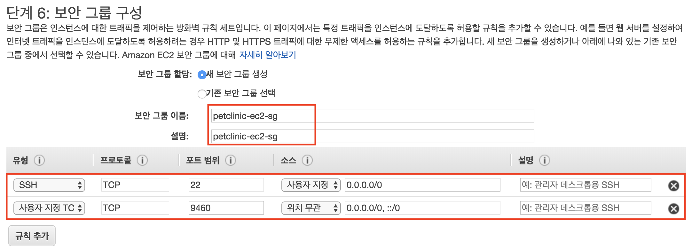
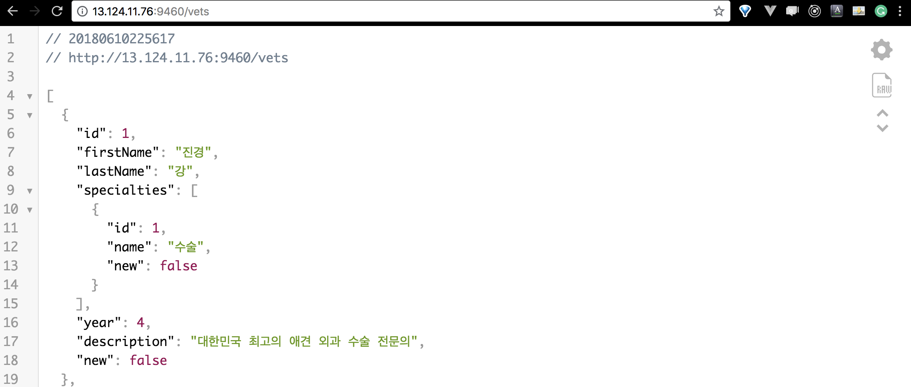
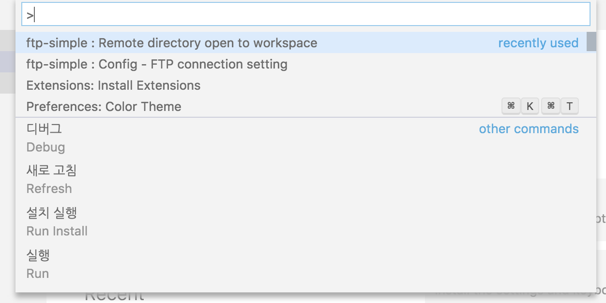

# ECS

동물병원 서비스를 ECS를 이용해서 배포해봅니다.

- backend repository : https://github.com/voyagerwoo/petclinic-rest
- frontend repository : https://github.com/voyagerwoo/petclinic-front


## Index

1. Prerequisites
1. EC2 + S3로 서비스 배포하기
1. ecs web console을 이용하여 배포하기
1. ecs cli를 이용하여 배포하기
1. CI / CD 파이프라인 구축하기
1. spring config server 배포하기

## Prerequisites
실습전에 준비해야할 사항들입니다

1. `github` 계정, `aws` 계정
1. 개발환경 설정 : [링크 DEV_ENV.md](DEV_ENV.md)
1. 우선 개발환경에 fork한 petclinic-rest, petclinic-front를 clone

## EC2 + S3로 서비스 배포하기

### EC2 배포하기

1. Amazon Linux AMI 2018.03.0 (HVM), SSD Volume Type - t2.micro 인스턴스를 하나 실행시킵니다. 이 인스턴스의 이름은 `petclinic ec2` 입니다. 
    
    ***보안 그룹***
    
    ***키페어 이름 - petclinic***
    
1. `petclinc ec2` 인스턴스의 java 버전을 8로 업그레이드 합니다. (관련 링크 : http://jojoldu.tistory.com/261)
    ```bash
    sudo yum install -y java-1.8.0-openjdk-devel.x86_64
    sudo /usr/sbin/alternatives --config java
    sudo yum remove java-1.7.0-openjdk
    javac -version
    ```
1. `petclinic ec2` 인스턴스에 git을 설치합니다.
    ```bash
    sudo yum install git
    ```

1. 배포 
    ```bash 
    git clone https://github.com/{your-github-name}/petclinic-rest
    cd petclinic-rest
    ./mvnw spring-boot:run
    ```

1. 확인 하기

     - 브라우저에서 `http://your-public-ip:9460/actuator/health` 접속하여 확인
     - 브라우저에서 `http://your-public-ip:9460/vets`(수의사 리스트 API) 접속하여 확인
     
     
    
    

### 프론트앤드 S3에 배포하기

1. 버켓 만들기 
    
    이름은 중복되지 않도록 `${자신의 아이디}-petclinc-www` 로 짓는다. 
    
    정적 웹사이트 호스팅 설정     
    
    버켓 퍼블릭으로 설정
    

1. vs code로 개발환경 접속
    
    
    

1. 코드 수정
    1. 배포스크립트 수정
    
        package.json에 deploy:s3 스크립트에서 bucket 명을 prerequisites에서 만든 자신의 버켓명으로 수정한다.
        ```json
        ...
        "deploy:s3": "npm run build && aws s3 cp dist/ s3://{your-bucket-name} --recursive"
        ...
        ```
    1. api host 수정
    
        src/services/restService.js 에서 서비스 호스트를 배포된 호스트로 변경한다.
        ```js
        const serviceHost = 'http://your-public-ip:9460'
        ```
1. 배포
    1. ssh로 개발환경 접속
    1. 배포 스크립트 실행
    ```bash
    cd /home/ec2-user/workspace/petclinic-front/
    npm install
    npm run deploy:s3
    ```
1. 확인
    1. http://{your-bucket-name}.s3-website.ap-northeast-2.amazonaws.com 에 접속하여 확인한다.
    1. http://{your-bucket-name}.s3-website.ap-northeast-2.amazonaws.com/#/staff 에 접속하여 수의사 리스트가 나오는지 확인한다.

### :coffee: coffee break
ec2에 백앤드 서비스를 배포해 보았다. 간단하지만 단점들이 존재한다.

#### 단점
- 인스턴스를 매번 띄우고 멈추는 관리가 필요하다.
- 인스턴스에 내가 원하는 배포환경으로 설치해주어야 한다.
- 롤링 업데이트는 어떻게 해야하나...

## ECS를 이용하여 백앤드 배포하기

### ecs cli를 이용하여 배포하기
working dir : petclinic-rest

1. create and push ecr
    ```bash
    ./1_create_and_push_ecr.sh
    ```
1. create cluster
    ```bash
    ./2_create_cluster.sh 
    ```
    
1. create alb
    ```bash
    ./3_create_alb.sh 
    ```
    
1. create and run service
    ```bash
    ./4_create_and_run_service.sh 
    ```
    
    여기 까지 하면 서비스가 반영된다.
    
1. update service
    ```bash
    ./5_update_service.sh 
    ```
    코드를 수정하고 이 스크립트롤 실행하면 반영된다.
    

반영되고 petclinic-front에서 api host를 변경하고 다시 배포해본다. 

### CI / CD 파이프라인 구축하기

1. code builder 설정

1. code pipeline 설정


### spring config server 배포하기
